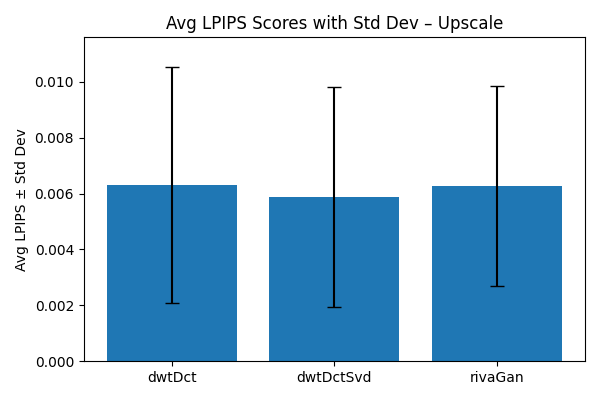
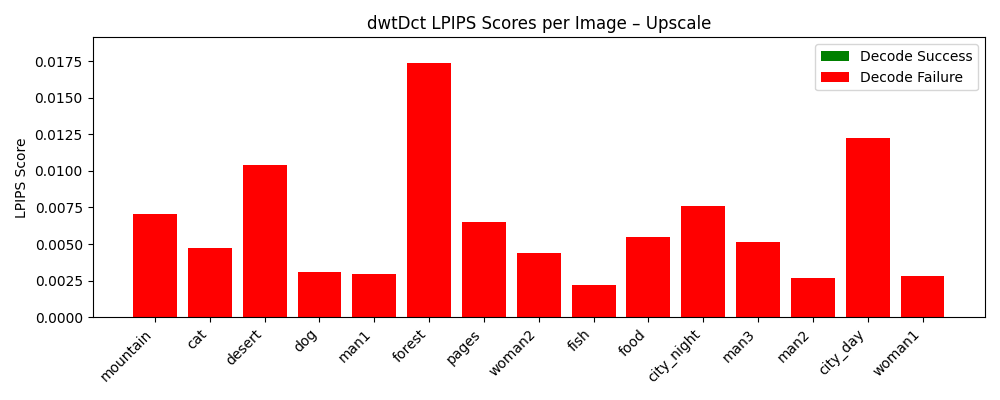
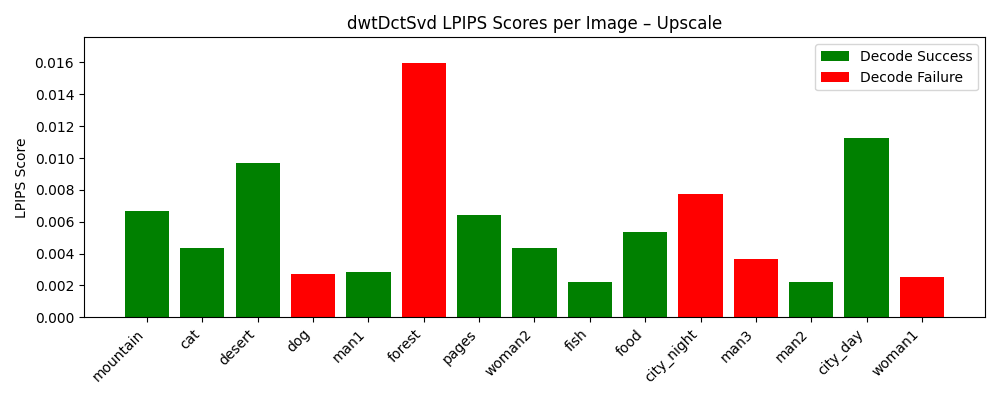
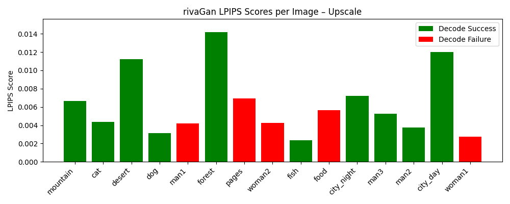

# Upscale LPIPS Analysis

## Average LPIPS ± Std Dev

## Per-Image LPIPS by Method

### DWT-DCT

### DWT-DCT-SVD

### RivaGAN

*Bar color indicates decode result: green = success, red = failure.*
