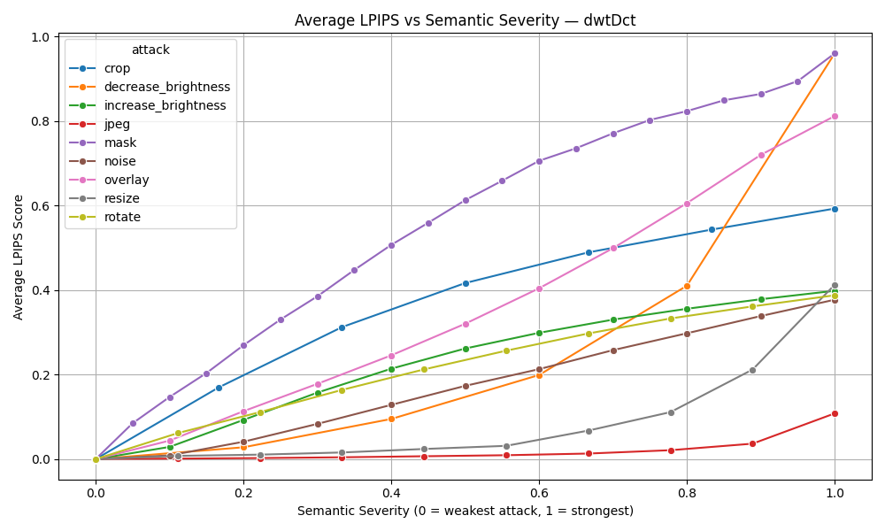
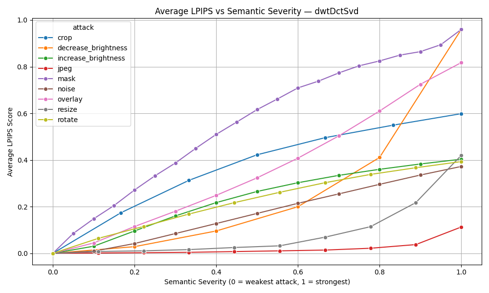
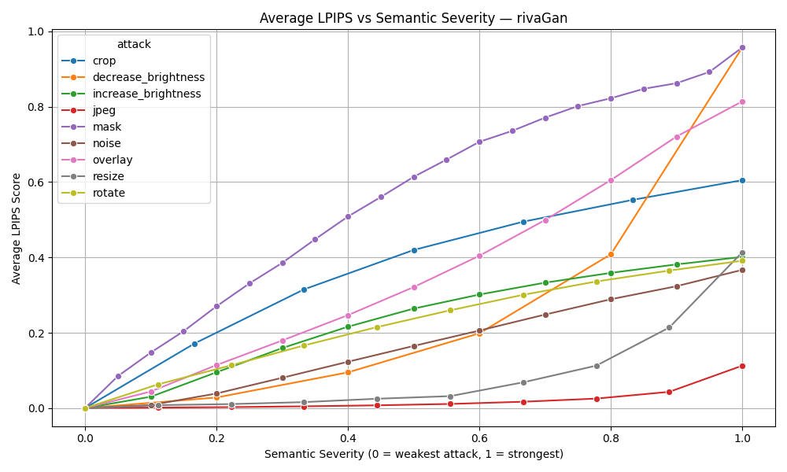

# 🔁 Average LPIPS vs Semantic Severity

These plots show the **average LPIPS score vs. semantic severity** for each attack type, grouped by method. Semantic severity is a normalized representation of how extreme the attack is, ranging from 0 (minimal attack) to 1 (maximum threshold tested).

This analysis answers: *At what semantic severity do watermark decodes begin to become too visually perceptible?*

### dwtDct

### dwtDctSvd

### rivaGan

