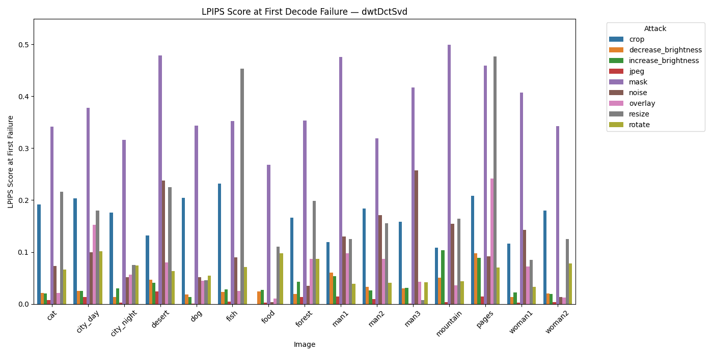
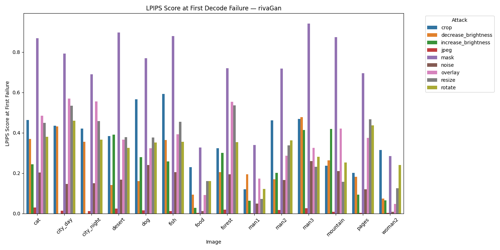

# 🖼️ LPIPS Score at First Decode Failure — By Image

These plots show the **LPIPS score at the first decode failure for each image and each attack**, separated by method. This gives insight into:

- How individual images vary in robustness
- Which attacks cause failure earliest (lowest LPIPS) on specific images

These graphs help identify outlier images or attack-method pairs with inconsistent performance.

### dwtDct

### dwtDctSvd

### rivaGan

