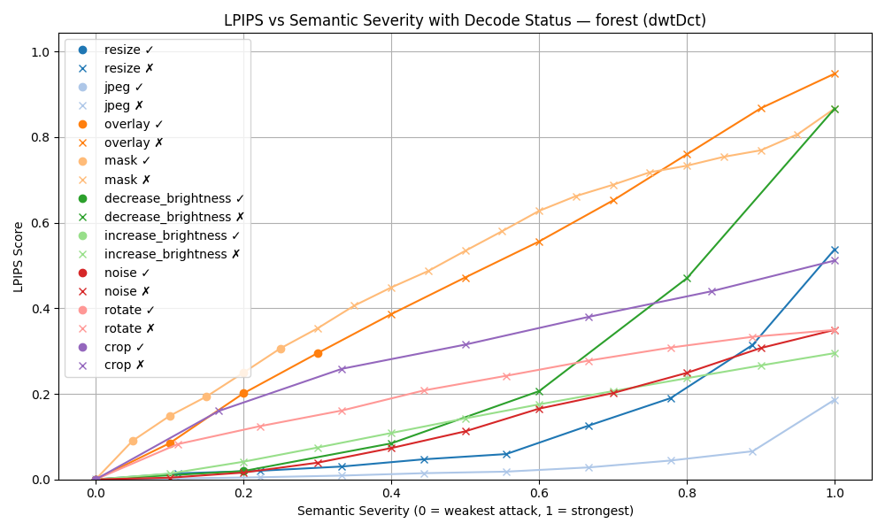
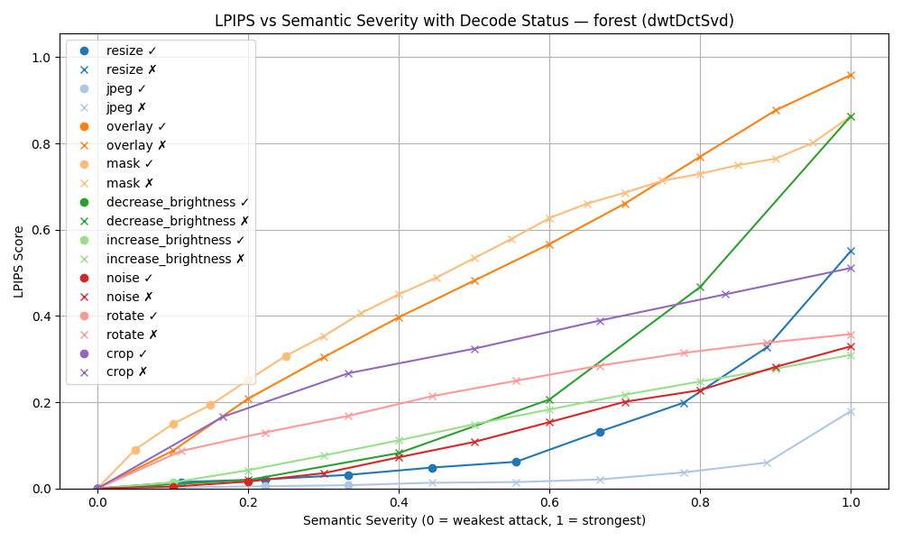
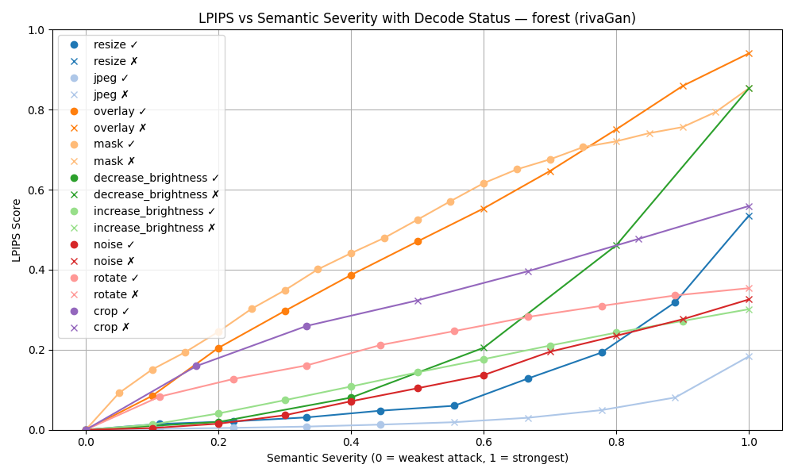

# 🧠 LPIPS vs Semantic Severity — Per Image & Method

These detailed plots visualize **LPIPS score vs. semantic severity** for each image under each method. A dot indicates successful decoding; an X indicates failure.

Each graph answers: *At what point does watermark decoding break down for each attack on this specific image and method?*

This helps us pinpoint:

- How robust each method is per image
- If any images are unusually sensitive or resilient to specific attacks

Below are the graphs for attacks on jpeg per method.

### dwtDct

...

### dwtDctSvd

...

### rivaGan

...
