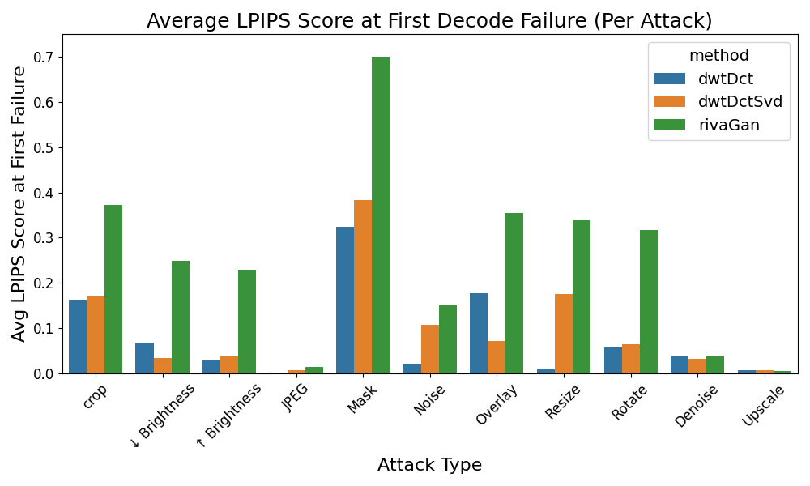
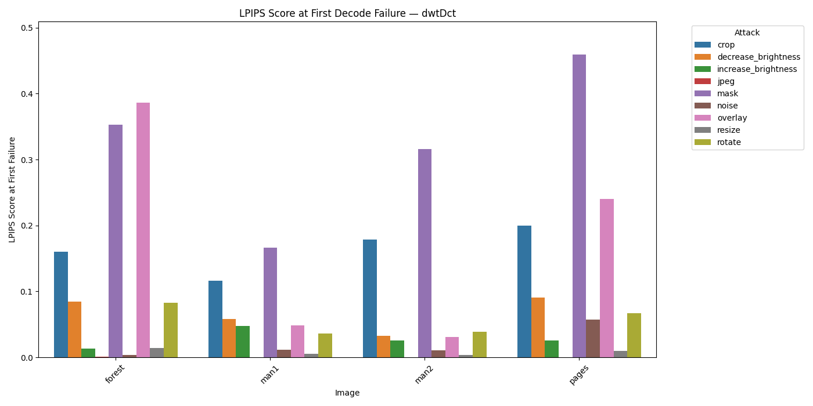

# 📘 LPIPS-Threshold Graph Summary

This directory presents a set of visualizations that explore how **perceptual similarity (LPIPS)** relates to **watermark decode success** across different image attacks and methods. These insights help evaluate the robustness of three watermarking techniques: **DWT-DCT**, **DWT-DCT-SVD**, and **RivaGAN**.

---

## 🧠 Observations


Based on the visualizations, several trends emerged regarding attack types and perceptual impact:

- **JPEG compression** appears to be a consistent weak point for all watermarking methods. While decoding often fails early, the corresponding **LPIPS scores remain low**, indicating that the image is still perceptually similar to the original. This suggests JPEG may be a useful **stealthy attack** that maintains visual quality while disrupting watermarking.
  
- Attacks like **overlay, masking, cropping, and brightness reduction** tend to lead to **higher LPIPS scores at first failure**, showing more noticeable perceptual degradation.

- **DWT-DCT** and **DWT-DCT-SVD** typically fail decoding earlier (lower thresholds) than **RivaGAN**, and therefore their **first-failure LPIPS scores are generally lower**. In contrast, **RivaGAN** demonstrates **more resilience**, with failures occurring later (at higher semantic severity) and producing **more varied and higher LPIPS scores**.

---


## 🔹 1. Average LPIPS Score at First Decode Failure

Summarizes the **average LPIPS score** when each method first fails to decode across attack types.

👉 See: [`avg_first_failure_lpips.md`](avg_first_failure_lpips.md)



→ RivaGAN generally shows higher LPIPS values at first failure than DWT-based methods.

---

## 🔹 2. LPIPS Score at First Decode Failure — By Image

Breaks down LPIPS scores at first failure for **each image**, grouped by method.

👉 See: [`first_failure_lpips_by_image.md`](first_failure_lpips_by_image.md)



---

## 🔹 3. Average LPIPS vs Semantic Severity

Shows how LPIPS varies with **semantic severity of attack** (i.e., normalized threshold strength) across attack types and methods.

👉 See: [`avg_lpips_vs_semantic_severity.md`](avg_lpips_vs_semantic_severity.md)


---

## 🔹 4. LPIPS vs Semantic Severity — Per Image & Method

Provides **image-by-image** plots of LPIPS vs semantic severity, including **success/failure markers** for decode status.

👉 See: [`imagewise_decode_status.md`](imagewise_decode_status.md)


---

## 📂 Folder Structure

```plaintext
LPIPS_Threshold_Graphs/
│
├── avg_first_failure_lpips.png
├── avg_first_failure_lpips.md
│
├── avg_lpips_vs_semantic_severity/
│   ├── avg_lpips_vs_semantic_severity_dwtDct.png
│   ├── avg_lpips_vs_semantic_severity_dwtDctSvd.png
│   ├── avg_lpips_vs_semantic_severity_rivaGan.png
├── avg_lpips_vs_semantic_severity.md
│
├── first_failure_lpips_plots/
│   ├── dwtDct_lpips_first_failure_by_image.png
│   ├── dwtDctSvd_lpips_first_failure_by_image.png
│   ├── rivaGan_lpips_first_failure_by_image.png
├── first_failure_lpips_by_image.md
│
├── imagewise_decode_graphs/
│   ├── dwtDct_imagewise_decode_graphs/
│   ├── dwtDctSvd_imagewise_decode_graphs/
│   ├── rivaGan_imagewise_decode_graphs/
├── imagewise_decode_status.md
│
└── lpips_summary.md  ← (you are here)
