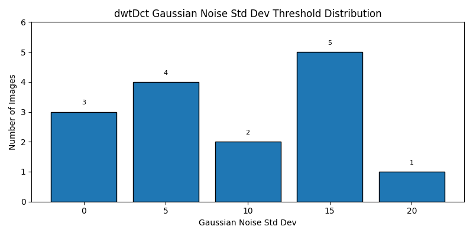
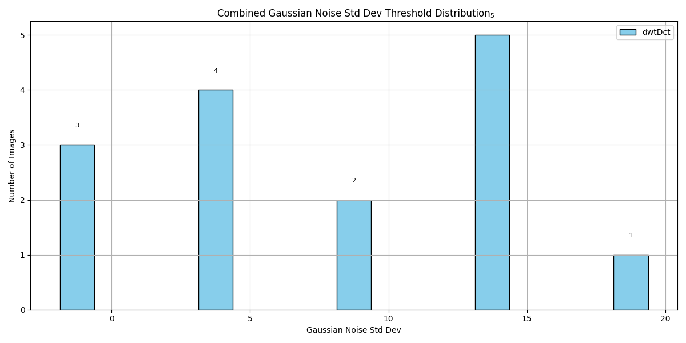

# 📊 Gaussian_Noise Threshold Summary

This summary includes average, median, and standard deviation of Gaussian Noise Std Dev thresholds at which watermark decoding failed.

| Method | Images | Failures | Avg Threshold | Median | Std Dev | Min | Max |
|--------|--------|----------|----------------|--------|---------|-----|-----|
| dwtDct | 15 | 3 | 9.00 | 10.00 | 6.38 | 0 | 20 |

---
### dwtDct Threshold Distribution

## 🔄 Combined Threshold Distribution

