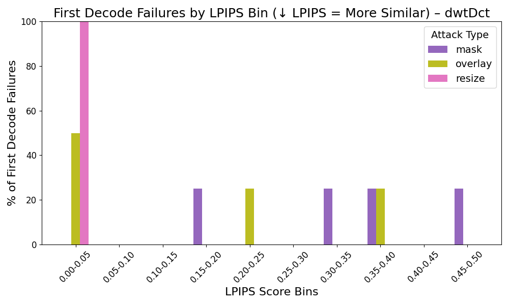

# 📊 LPIPS Failure Distribution by Attack Severity

To better illustrate how attacks differ in perceptual severity, we separated the first decode failure LPIPS distributions into two groups based on their overall LPIPS ranges:

## Low-LPIPS Attacks (e.g., jpeg, denoising, upscale, noise)

These attacks tend to trigger decode failures at very low perceptual differences, often under LPIPS 0.10. This suggests that these methods cause subtle but critical changes to the image that disrupt watermark decoding without significantly altering visual appearance. For instance:

* JPEG and upscale attacks cluster in the 0.00–0.05 bin.

* Denoising shows a slightly broader spread but still primarily in low LPIPS bins.

* Failures from these attacks are perceptually invisible or near-invisible, emphasizing their stealthiness.

### dwtDct

### dwtDctSvd

### rivaGan

Some attacks evaluated in these graphs — specifically denoising and upscale — are binary in nature and were not tested across a range of thresholds. Instead, they were applied uniformly to each image. As a result, the LPIPS distributions for these attacks represent the subset of images where decoding failed under that single perturbation level.

* Denoising:
  * dwtDct and dwtDctSvd failed to decode all 15 images.
  * rivaGan failed to decode 8 out of 15 images.

* Upscale:
  * dwtDct failed on all 15 images.
  * dwtDctSvd failed on 5, and rivaGan failed on 5 images.

This highlights an important distinction:

* JPEG Compression, though perceptually subtle, maintains a high decode success rate, resulting in fewer data points in the failure distribution.

* Upscale, which is similarly low in perceptual distortion (i.e., low LPIPS), causes more decode failures, giving it a broader or more concentrated presence in the distribution.

## High-LPIPS Attacks (e.g., mask, overlay, resize)

In contrast, these attacks often require larger perceptual distortions before watermark decoding fails:

* Resize and overlay failures begin to emerge around 0.20–0.35 LPIPS.

* Mask attacks result in a much broader LPIPS spread, with failures appearing even in very high bins (0.80+ for RivaGAN).

This separation provides insight into the stealth vs. severity tradeoff:
Low-LPIPS attacks are effective while being subtle, whereas high-LPIPS attacks typically require more visible distortion to break the watermark.

### dwtDct

### dwtDctSvd

### rivaGan

