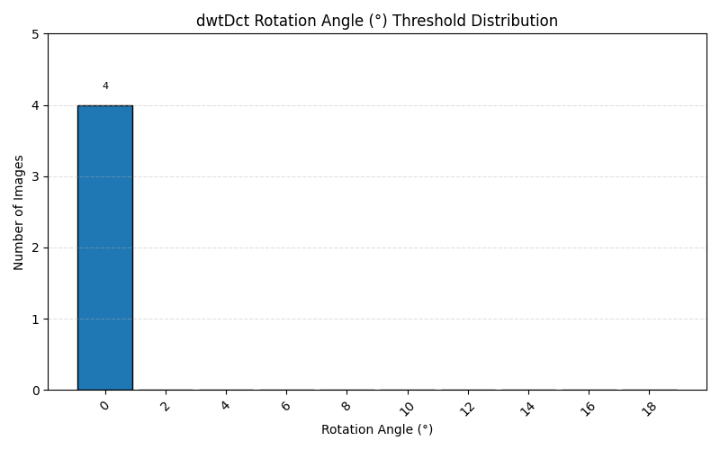
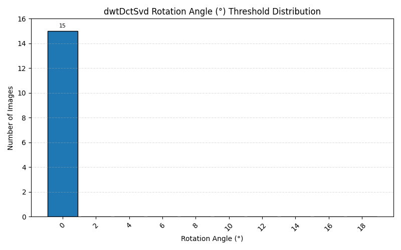
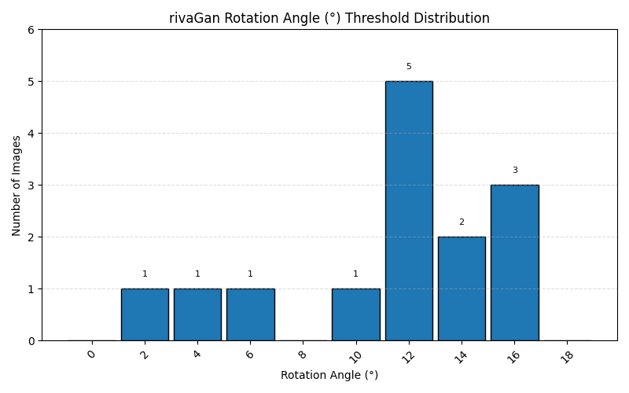
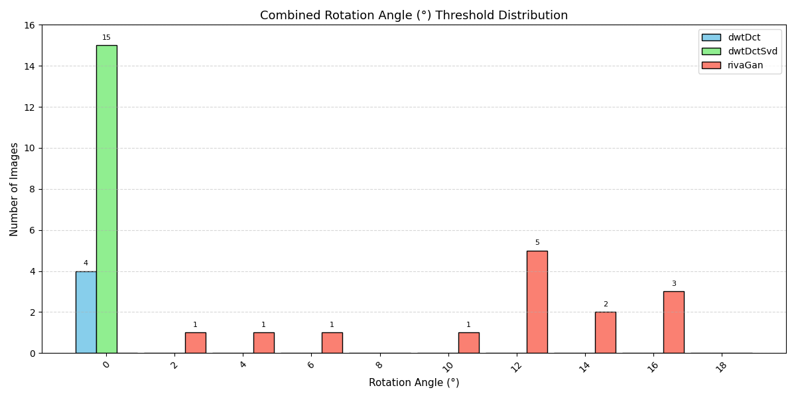

# 📊 Rotate Threshold Summary

> 📘 **Rotation thresholds reflect the maximum degree of rotation where watermark decoding was still successful.**

This summary reports the robustness of each watermarking method under threshold-based attacks.
- **Clean Failures**: Number of images where the method failed to decode the original, unattacked watermarked image. These images are excluded from threshold calculations.
- **Attack Failures**: Number of images that failed decoding at all tested attack levels.
- **Threshold Statistics**: Calculated only from images that passed the clean test and at least one attack level. Includes average, median, standard deviation, minimum, and maximum threshold values observed.

| Method | Images | Clean Failures | Attack Failures | # Valid Thresholds | Avg Threshold | Median | Std Dev | Min | Max |
|--------|--------|----------------|------------------|---------------------|----------------|--------|---------|-----|-----|
| dwtDct | 15 | 11 | 11 | 4 | 0.00 | 0.00 | 0.00 | 0.00 | 0.00 |
| dwtDctSvd | 15 | 0 | 0 | 15 | 0.00 | 0.00 | 0.00 | 0.00 | 0.00 |
| rivaGan | 15 | 1 | 1 | 14 | 11.29 | 12.00 | 4.25 | 2.00 | 16.00 |

---
### dwtDct Threshold Distribution

### dwtDctSvd Threshold Distribution

### rivaGan Threshold Distribution

## Combined Threshold Distribution

