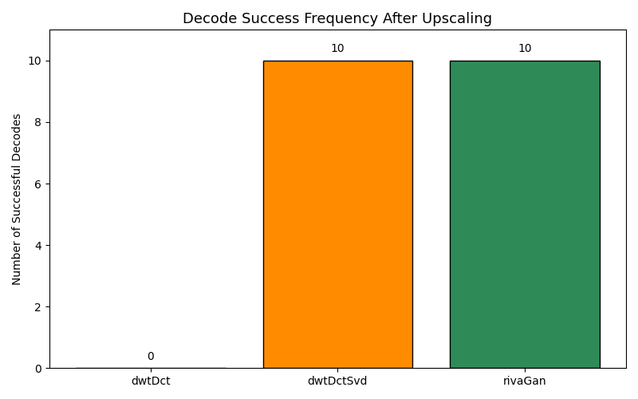
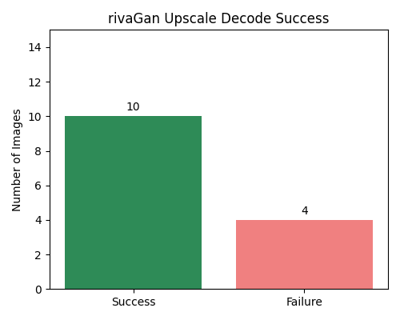

# 🧠 Upscale Decode Summary

This summary reports how many images each method successfully decoded after AI upscaling.

| Method | Total Images | Clean Failures | Decode Success | Decode Failure |
|--------|---------------|----------------|----------------|----------------|
| dwtDct | 15 | 11 | 0 | 4 |
| dwtDctSvd | 15 | 0 | 10 | 5 |
| rivaGan | 15 | 1 | 10 | 4 |

---
## Combined Decode Frequencies

### dwtDct Decode Results

### dwtDctSvd Decode Results

### rivaGan Decode Results

