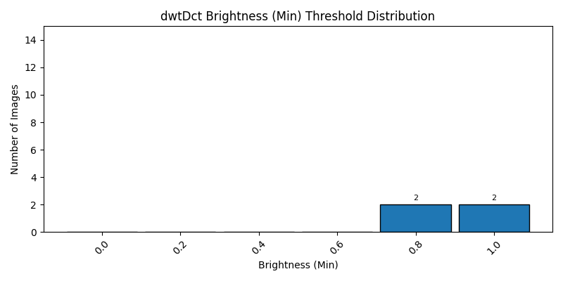
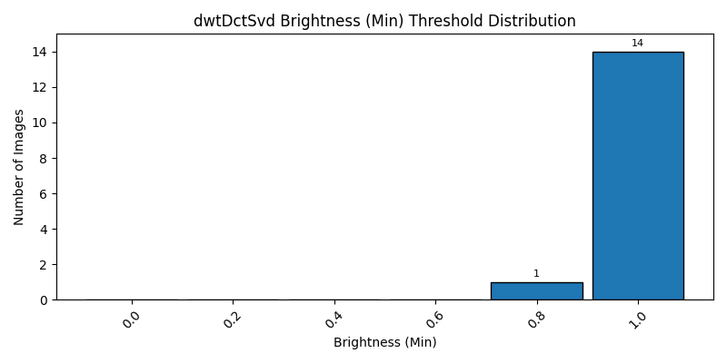
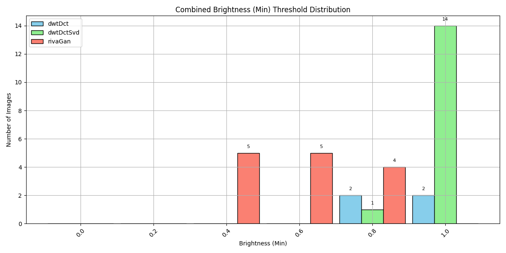
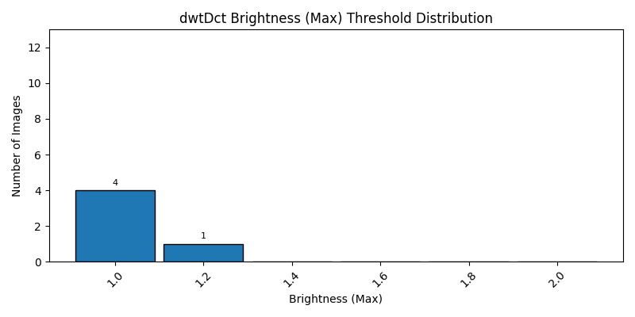
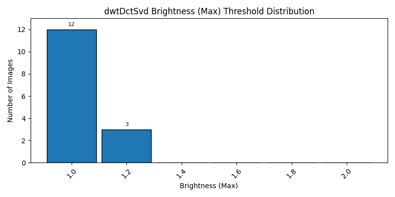
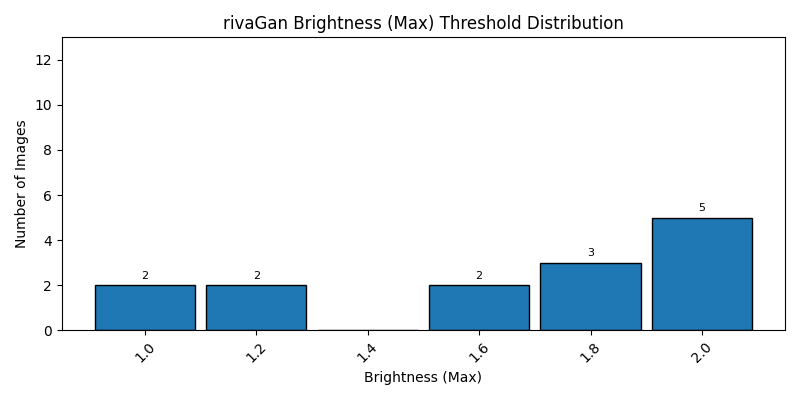
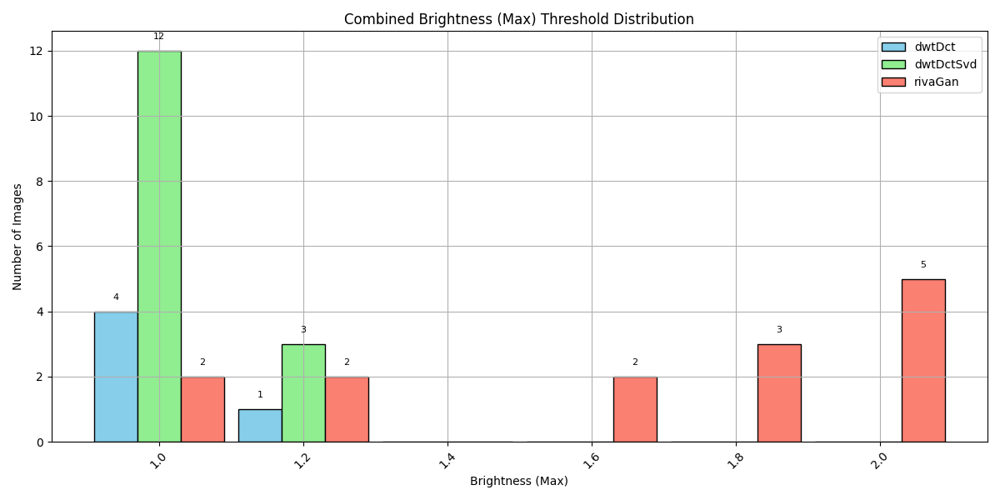

# 📊 Brightness Threshold Summary

This summary includes average, median, and standard deviation of brightness thresholds at which watermark decoding failed.

| Method | Images | Failures | Avg Threshold | Median | Std Dev | Min | Max |
|--------|--------|----------|----------------|--------|---------|-----|-----|
| dwtDct | 15 | 10 | 1.00 | 1.00 | 0.13 | 0.8 | 1.2 |
| dwtDctSvd | 15 | 0 | 1.01 | 1.00 | 0.07 | 0.8 | 1.2 |
| rivaGan | 15 | 1 | 1.11 | 0.90 | 0.60 | 0.4 | 2.0 |

---
## Lowest Brightness (0.0-1.0)

### Individual Distribution

### Combined Threshold Distribution

## Highest Brightness (1.0-2.0)

### Individual Distribution

### Combined Threshold Distribution

