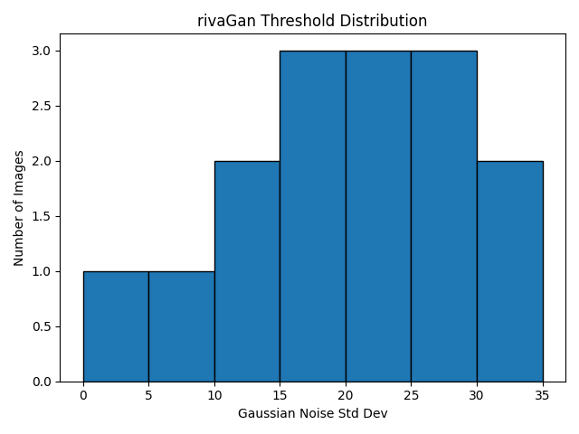
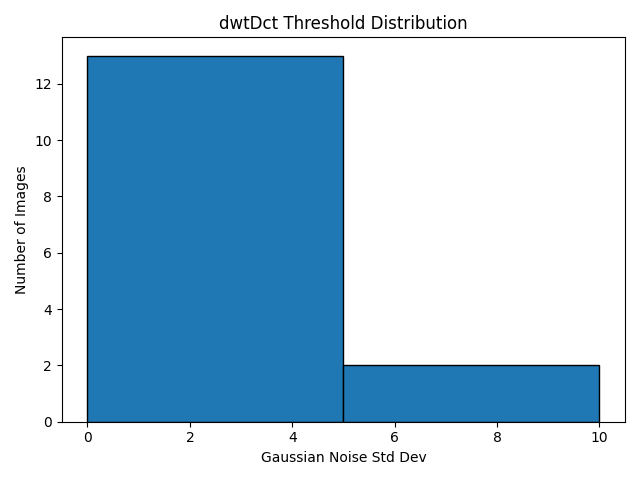
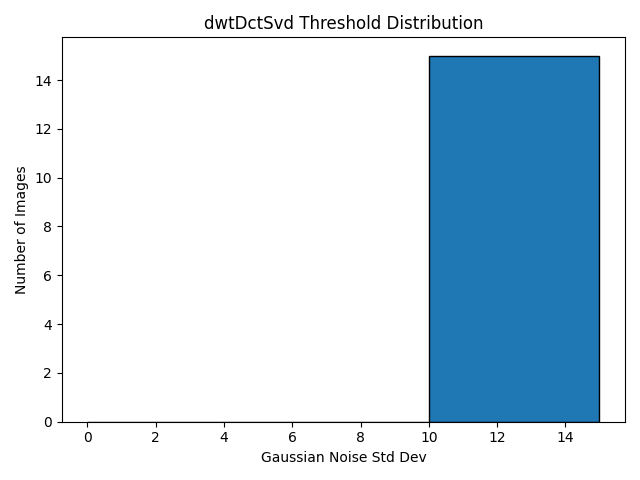
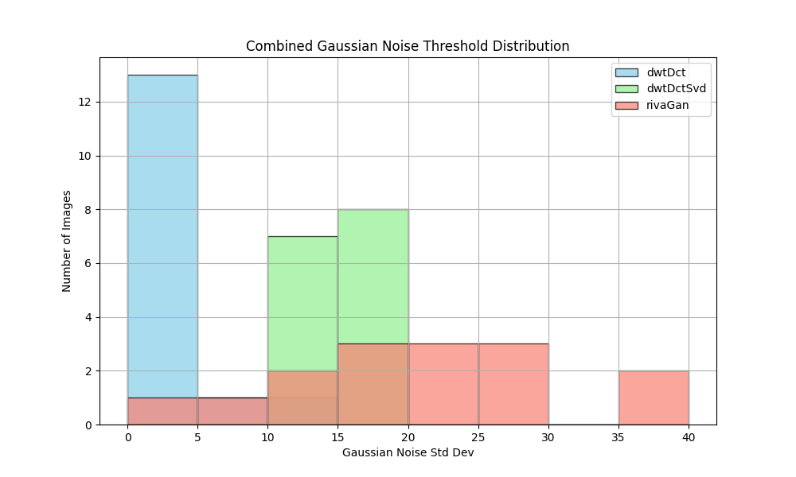
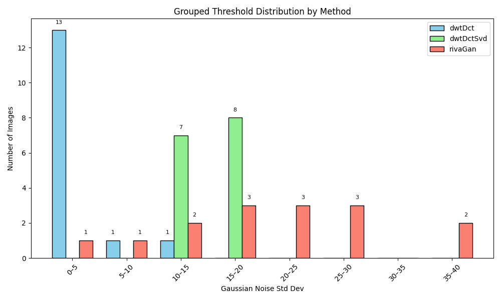

# 📊 Gaussian Noise Threshold Summary

This summary includes average, median, and standard deviation of the noise thresholds at which watermark decoding failed.

| Method | Images | Failures | Avg Threshold | Median | Std Dev | Min | Max |
|--------|--------|----------|----------------|--------|---------|-----|-----|
| rivaGan | 15 | 1 | 18.33 | 20.00 | 9.60 | 0 | 35 |
| dwtDct | 15 | 11 | 1.00 | 0.00 | 2.71 | 0 | 10 |
| dwtDctSvd | 15 | 0 | 12.67 | 15.00 | 2.49 | 10 | 15 |

---
### rivaGan Threshold Distribution

### dwtDct Threshold Distribution

### dwtDctSvd Threshold Distribution

---
## 🔄 Combined Threshold Distribution
This histogram compares the Gaussian noise decoding thresholds across all three watermarking methods.

---
## 📊 Grouped Threshold Distribution
This chart separates decoding threshold bars by method for each noise level.

