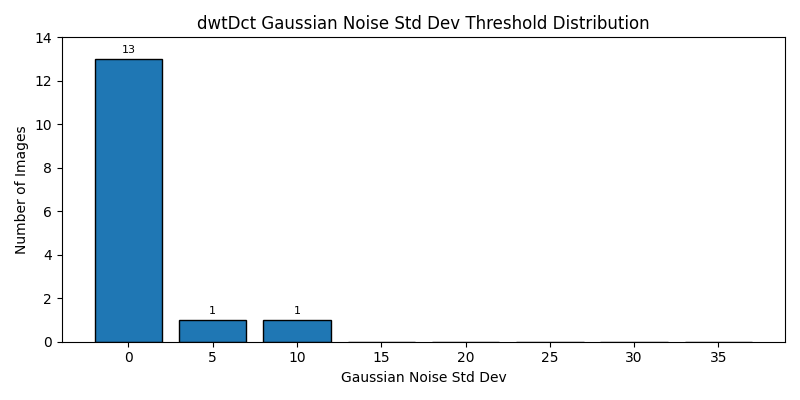
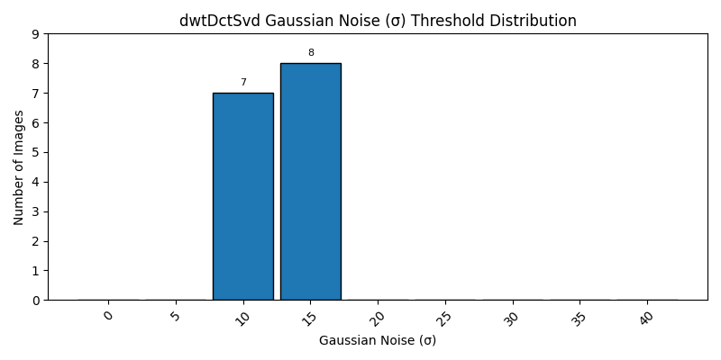
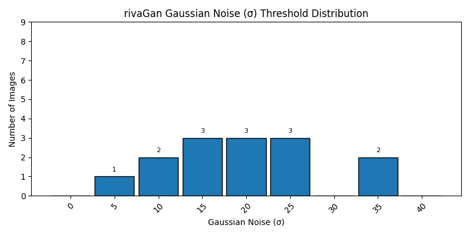
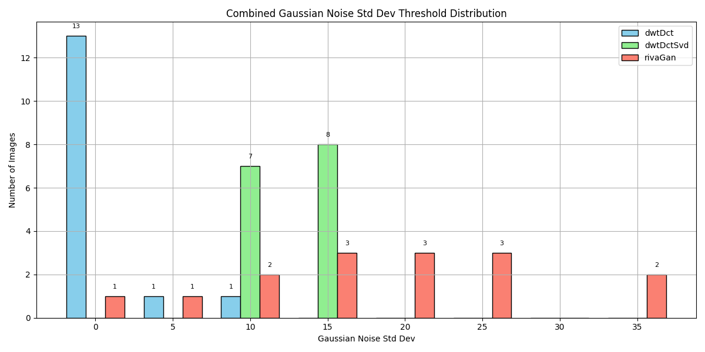

# 📊 Gaussian_Noise Threshold Summary

This summary includes average, median, and standard deviation of Gaussian Noise Std Dev thresholds at which watermark decoding failed.

| Method | Images | Failures | Avg Threshold | Median | Std Dev | Min | Max |
|--------|--------|----------|----------------|--------|---------|-----|-----|
| dwtDct | 15 | 13 | 1.00 | 0.00 | 2.71 | 0 | 10 |
| dwtDctSvd | 15 | 0 | 12.67 | 15.00 | 2.49 | 10 | 15 |
| rivaGan | 15 | 1 | 18.33 | 20.00 | 9.60 | 0 | 35 |

---
### dwtDct Threshold Distribution

### dwtDctSvd Threshold Distribution

### rivaGan Threshold Distribution

## 🔄 Combined Threshold Distribution

