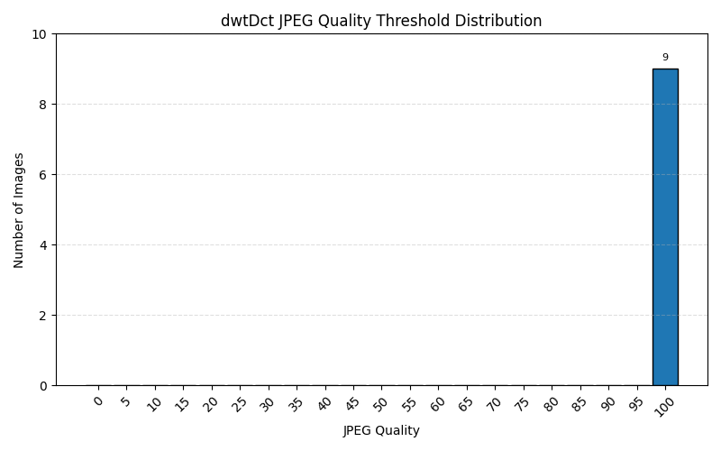
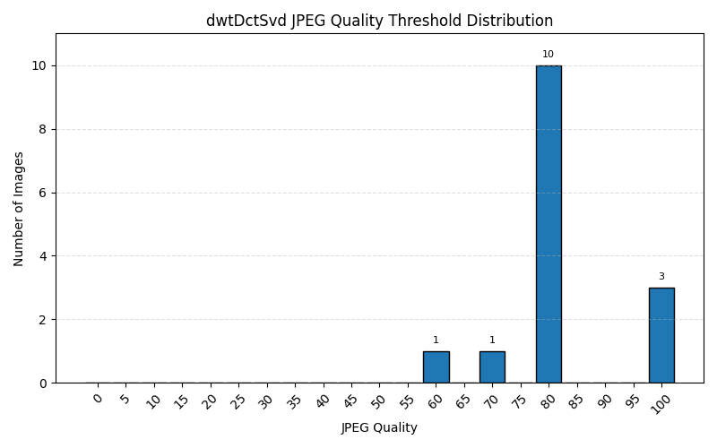
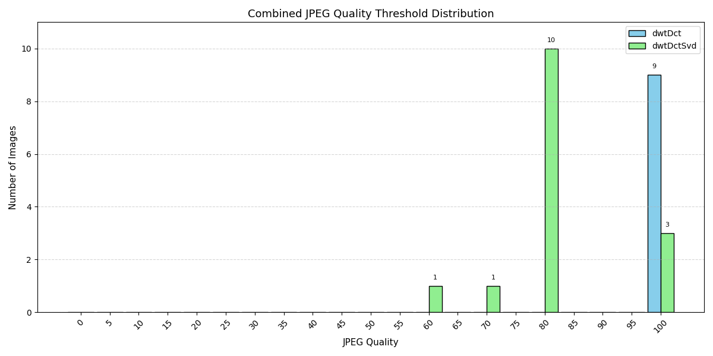

# 📊 Jpeg Threshold Summary

> 📘 **JPEG compression thresholds represent the lowest JPEG quality setting where the watermark could still be successfully decoded. Lower values indicate greater robustness.**

This summary reports the robustness of each watermarking method under threshold-based attacks.
- **Clean Failures**: Number of images where the method failed to decode the original, unattacked watermarked image. These images are excluded from threshold calculations.
- **Attack Failures**: Number of images that failed decoding at all tested attack levels.
- **Threshold Statistics**: Calculated only from images that passed the clean test and at least one attack level. Includes average, median, standard deviation, minimum, and maximum threshold values observed.

| Method | Images | Clean Failures | Attack Failures | # Valid Thresholds | Avg Threshold | Median | Std Dev | Min | Max |
|--------|--------|----------------|------------------|---------------------|----------------|--------|---------|-----|-----|
| dwtDct | 15 | 2 | 6 | 9 | 100.00 | 100.00 | 0.00 | 100.00 | 100.00 |
| dwtDctSvd | 15 | 0 | 0 | 15 | 82.00 | 80.00 | 10.46 | 60.00 | 100.00 |

---
### dwtDct Threshold Distribution

### dwtDctSvd Threshold Distribution

## Combined Threshold Distribution

