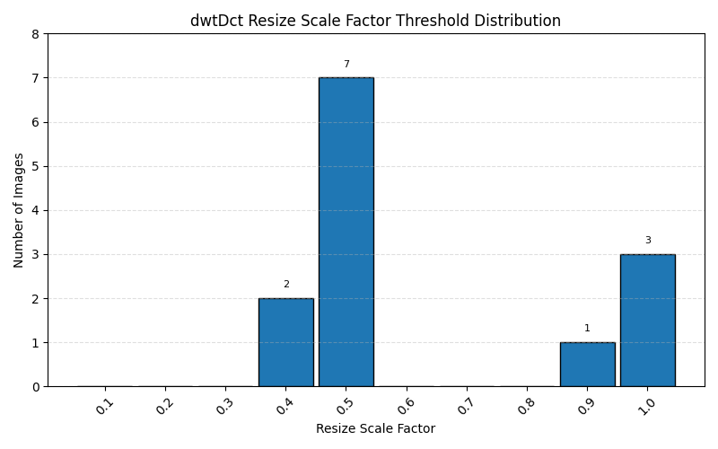
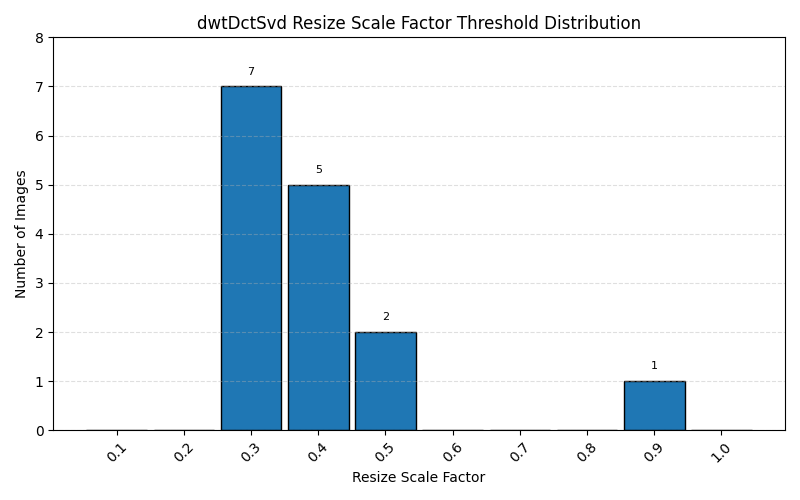
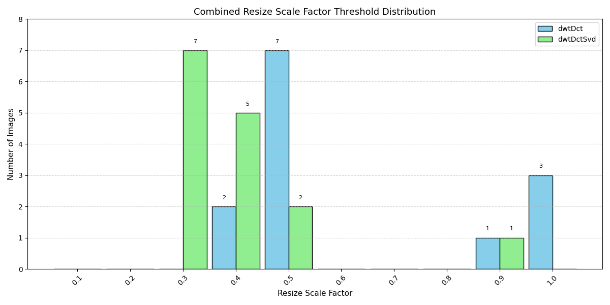

# 📊 Resize Threshold Summary

> 📘 **Resize thresholds indicate the smallest scaling factor (as a fraction of original size) where watermark decoding still succeeded. Lower values reflect better robustness to downscaling.**

This summary reports the robustness of each watermarking method under threshold-based attacks.
- **Clean Failures**: Number of images where the method failed to decode the original, unattacked watermarked image. These images are excluded from threshold calculations.
- **Attack Failures**: Number of images that failed decoding at all tested attack levels.
- **Threshold Statistics**: Calculated only from images that passed the clean test and at least one attack level. Includes average, median, standard deviation, minimum, and maximum threshold values observed.

| Method | Images | Clean Failures | Attack Failures | # Valid Thresholds | Avg Threshold | Median | Std Dev | Min | Max |
|--------|--------|----------------|------------------|---------------------|----------------|--------|---------|-----|-----|
| dwtDct | 15 | 2 | 2 | 13 | 0.63 | 0.50 | 0.23 | 0.40 | 1.00 |
| dwtDctSvd | 15 | 0 | 0 | 15 | 0.40 | 0.40 | 0.15 | 0.30 | 0.90 |

---
### dwtDct Threshold Distribution

### dwtDctSvd Threshold Distribution

## Combined Threshold Distribution

